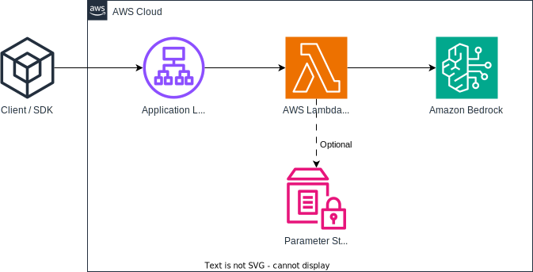
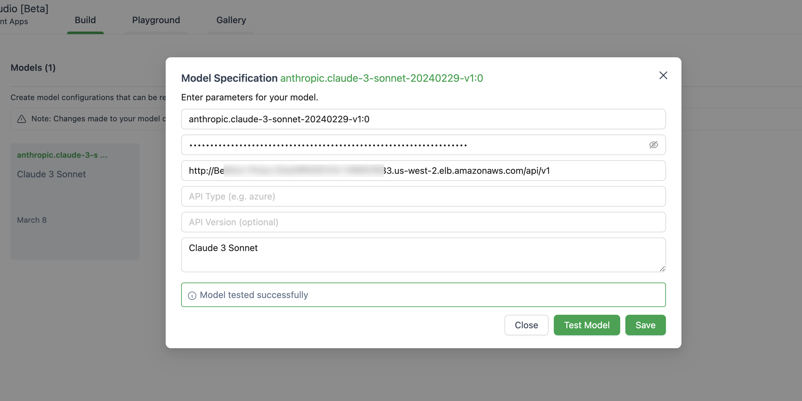

[中文](./README_CN.md)

# Bedrock Access Gateway

OpenAI-compatible RESTful APIs for Amazon Bedrock

## Breaking Changes

The source code is refactored with the new [Converse API](https://docs.aws.amazon.com/bedrock/latest/userguide/conversation-inference.html) by bedrock which provides native support with tool calls.

If you are facing any problems, please raise an issue.


## Overview

Amazon Bedrock offers a wide range of foundation models (such as Claude 3 Opus/Sonnet/Haiku, Llama 2/3, Mistral/Mixtral,
etc.) and a broad set of capabilities for you to build generative AI applications. Check the [Amazon Bedrock](https://aws.amazon.com/bedrock) landing page for additional information.

Sometimes, you might have applications developed using OpenAI APIs or SDKs, and you want to experiment with Amazon Bedrock without modifying your codebase. Or you may simply wish to evaluate the capabilities of these foundation models in tools like AutoGen etc. Well, this repository allows you to access Amazon Bedrock models seamlessly through OpenAI APIs and SDKs, enabling you to test these models without code changes.

If you find this GitHub repository useful, please consider giving it a free star ⭐ to show your appreciation and support for the project.

**Features:**

- [x] Support streaming response via server-sent events (SSE)
- [x] Support Model APIs
- [x] Support Chat Completion APIs
- [x] Support Tool Call (**new**)
- [x] Support Embedding API (**new**)
- [x] Support Multimodal API (**new**)
- [x] Support Cross-Region Inference (**new**)

Please check [Usage Guide](./docs/Usage.md) for more details about how to use the new APIs.

> **Note:** The legacy [text completion](https://platform.openai.com/docs/api-reference/completions) API is not supported, you should change to use chat completion API.

Supported Amazon Bedrock models family:

- Anthropic Claude 2 / 3 (Haiku/Sonnet/Opus) / 3.5 Sonnet
- Meta Llama 2 / 3
- Mistral / Mixtral
- Cohere Command R / R+
- Cohere Embedding

You can call the `models` API to get the full list of model IDs supported.

> **Note:** The default model is set to `anthropic.claude-3-sonnet-20240229-v1:0` which can be changed via Lambda environment variables (`DEFAULT_MODEL`).

## Get Started

### Prerequisites

Please make sure you have met below prerequisites:

- Access to Amazon Bedrock foundation models.

> For more information on how to request model access, please refer to the [Amazon Bedrock User Guide](https://docs.aws.amazon.com/bedrock/latest/userguide/model-access.html) (Set Up > Model access)

### Architecture

The following diagram illustrates the reference architecture. Note that it also includes a new **VPC** with two public subnets only for the Application Load Balancer (ALB).



You can also choose to use [AWS Fargate](https://aws.amazon.com/fargate/) behind the ALB instead of [AWS Lambda](https://aws.amazon.com/lambda/), the main difference is the latency of the first byte for streaming response (Fargate is lower).

Alternatively, you can use Lambda Function URL to replace ALB, see [example](https://github.com/awslabs/aws-lambda-web-adapter/tree/main/examples/fastapi-response-streaming)

### Deployment

Please follow the steps below to deploy the Bedrock Proxy APIs into your AWS account. Only supports regions where Amazon Bedrock is available (such as `us-west-2`). The deployment will take approximately **3-5 minutes** 🕒.

**Step 1: Create your own custom API key (Optional)**

> **Note:** This step is to use any string (without spaces) you like to create a custom API Key (credential) that will be used to access the proxy API later. This key does not have to match your actual OpenAI key, and you don't need to have an OpenAI API key. It is recommended that you take this step and ensure that you keep the key safe and private.

1. Open the AWS Management Console and navigate to the Systems Manager service.
2. In the left-hand navigation pane, click on "Parameter Store".
3. Click on the "Create parameter" button.
4. In the "Create parameter" window, select the following options:
    - Name: Enter a descriptive name for your parameter (e.g., "BedrockProxyAPIKey").
    - Description: Optionally, provide a description for the parameter.
    - Tier: Select **Standard**.
    - Type: Select **SecureString**.
    - Value: Any string (without spaces).
5. Click "Create parameter".
6. Make a note of the parameter name you used (e.g., "BedrockProxyAPIKey"). You'll need this in the next step.

**Step 2: Deploy the CloudFormation stack**

1. Sign in to AWS Management Console, switch to the region to deploy the CloudFormation Stack to.
2. Click the following button to launch the CloudFormation Stack in that region. Choose one of the following:
   - **ALB + Lambda**

      [](https://console.aws.amazon.com/cloudformation/home#/stacks/create/template?stackName=BedrockProxyAPI&templateURL=https://aws-gcr-solutions.s3.amazonaws.com/bedrock-access-gateway/latest/BedrockProxy.template)
   - **ALB + Fargate**

      [](https://console.aws.amazon.com/cloudformation/home#/stacks/create/template?stackName=BedrockProxyAPI&templateURL=https://aws-gcr-solutions.s3.amazonaws.com/bedrock-access-gateway/latest/BedrockProxyFargate.template)
3. Click "Next".
4. On the "Specify stack details" page, provide the following information:
    - Stack name: Change the stack name if needed.
    - ApiKeyParam (if you set up an API key in Step 1): Enter the parameter name you used for storing the API key (e.g., `BedrockProxyAPIKey`). If you did not set up an API key, leave this field blank. Click "Next".
5. On the "Configure stack options" page, you can leave the default settings or customize them according to your needs.
6. Click "Next".
7. On the "Review" page, review the details of the stack you're about to create. Check the "I acknowledge that AWS CloudFormation might create IAM resources" checkbox at the bottom.
8. Click "Create stack".

That is it! 🎉 Once deployed, click the CloudFormation stack and go to **Outputs** tab, you can find the API Base URL from `APIBaseUrl`, the value should look like `http://xxxx.xxx.elb.amazonaws.com/api/v1`.

### SDK/API Usage

All you need is the API Key and the API Base URL. If you didn't set up your own key, then the default API Key (`bedrock`) will be used.

Now, you can try out the proxy APIs. Let's say you want to test Claude 3 Sonnet model (model ID: `anthropic.claude-3-sonnet-20240229-v1:0`)...

**Example API Usage**

```bash
export OPENAI_API_KEY=<API key>
export OPENAI_BASE_URL=<API base url>
# For older versions
# https://github.com/openai/openai-python/issues/624
export OPENAI_API_BASE=<API base url>
```

```bash
curl $OPENAI_BASE_URL/chat/completions \
  -H "Content-Type: application/json" \
  -H "Authorization: Bearer $OPENAI_API_KEY" \
  -d '{
    "model": "anthropic.claude-3-sonnet-20240229-v1:0",
    "messages": [
      {
        "role": "user",
        "content": "Hello!"
      }
    ]
  }'
```

**Example SDK Usage**

```python
from openai import OpenAI

client = OpenAI()
completion = client.chat.completions.create(
    model="anthropic.claude-3-sonnet-20240229-v1:0",
    messages=[{"role": "user", "content": "Hello!"}],
)

print(completion.choices[0].message.content)
```

Please check [Usage Guide](./docs/Usage.md) for more details about how to use embedding API, multimodal API and tool call.

### Bedrock Cross-Region Inference


Cross-Region Inference supports accessing foundation models across regions, allowing users to invoke models hosted in different AWS regions for inference. Main advantages:
- **Improved Availability**: Provides regional redundancy and enhanced fault tolerance. When issues occur in the primary region, services can failover to backup regions, ensuring continuous service availability and business continuity.
- **Reduced Latency**: Enables selection of regions geographically closest to users, optimizing network paths and reducing transmission time, resulting in better user experience and response times.
- **Better Performance and Capacity**: Implements load balancing to distribute request pressure, provides greater service capacity and throughput, and better handles traffic spikes.
- **Flexibility**: Allows selection of models from different regions based on requirements, meets specific regional compliance requirements, and enables more flexible resource allocation and management.
- **Cost Benefits**: Enables selection of more cost-effective regions, reduces overall operational costs through resource optimization, and improves resource utilization efficiency.


Please check [Bedrock Cross-Region Inference](https://docs.aws.amazon.com/bedrock/latest/userguide/cross-region-inference.html)

**limitation:**
Currently, Bedrock Access Gateway only supports cross-region Inference for the following models:
- Claude 3 Haiku
- Claude 3 Opus
- Claude 3 Sonnet
- Claude 3.5 Sonnet
- Meta Llama 3.1 8b Instruct
- Meta Llama 3.1 70b Instruct

**Prerequisites:**
- IAM policies must allow cross-region access,Callers need permissions to access models and inference profiles in both regions (added in cloudformation template)
- Model access must be enabled in both regions, which defined in inference profiles

**Example API Usage:**
- To use Bedrock cross-region inference, you include an inference profile when running model inference by specifying the ID of the inference profile as the modelId, such as `us.anthropic.claude-3-5-sonnet-20240620-v1:0`

```bash
curl $OPENAI_BASE_URL/chat/completions \
  -H "Content-Type: application/json" \
  -H "Authorization: Bearer $OPENAI_API_KEY" \
  -d '{
    "model": "us.anthropic.claude-3-5-sonnet-20240620-v1:0",
    "max_tokens": 2048,
    "messages": [
      {
        "role": "user",
        "content": "Hello!"
      }
    ]
  }'
```


## Other Examples

### AutoGen

Below is an image of setting up the model in AutoGen studio.



### LangChain

Make sure you use `ChatOpenAI(...)` instead of `OpenAI(...)`

```python
# pip install langchain-openai
import os

from langchain.chains import LLMChain
from langchain.prompts import PromptTemplate
from langchain_openai import ChatOpenAI

chat = ChatOpenAI(
    model="anthropic.claude-3-sonnet-20240229-v1:0",
    temperature=0,
    openai_api_key=os.environ['OPENAI_API_KEY'],
    openai_api_base=os.environ['OPENAI_BASE_URL'],
)

template = """Question: {question}

Answer: Let's think step by step."""

prompt = PromptTemplate.from_template(template)
llm_chain = LLMChain(prompt=prompt, llm=chat)

question = "What NFL team won the Super Bowl in the year Justin Beiber was born?"
response = llm_chain.invoke(question)
print(response)

```

## FAQs

### About Privacy

This application does not collect any of your data. Furthermore, it does not log any requests or responses by default.

### Why not used API Gateway instead of Application Load Balancer?

Short answer is that API Gateway does not support server-sent events (SSE) for streaming response.

### Which regions are supported?

This solution only supports the regions where Amazon Bedrock is available, as for now, below are the list.

- US East (N. Virginia): us-east-1
- US West (Oregon): us-west-2
- Asia Pacific (Singapore): ap-southeast-1
- Asia Pacific (Sydney): ap-southeast-2
- Asia Pacific (Tokyo): ap-northeast-1
- Europe (Frankfurt): eu-central-1
- Europe (Paris): eu-west-3

Generally speaking, all regions that Amazon Bedrock supports will also be supported, if not, please raise an issue in Github.

Note that not all models are available in those regions.

### Can I build and use my own ECR image

Yes, you can clone the repo and build the container image by yourself (`src/Dockerfile`) and then push to your ECR repo. You can use `scripts/push-to-ecr.sh`

Replace the repo url in the CloudFormation template before you deploy.

### Can I run this locally

Yes, you can run this locally.

The API base url should look like `http://localhost:8000/api/v1`.

### Any performance sacrifice or latency increase by using the proxy APIs

Comparing with the AWS SDK call, the referenced architecture will bring additional latency on response, you can try and test that on you own.

Also, you can use Lambda Web Adapter + Function URL (see [example](https://github.com/awslabs/aws-lambda-web-adapter/tree/main/examples/fastapi-response-streaming)) to replace ALB or AWS Fargate to replace Lambda to get better performance on streaming response.

### Any plan to support SageMaker models?

Currently, there is no plan to support SageMaker models. This may change provided there's a demand from customers.

### Any plan to support Bedrock custom models?

Fine-tuned models and models with Provisioned Throughput are currently not supported. You can clone the repo and make the customization if needed.

### How to upgrade?

To use the latest features, you don't need to redeploy the CloudFormation stack. You simply need to pull the latest image.

To do so, depends on which version you deployed:

- **Lambda version**: Go to AWS Lambda console, find the Lambda function, then find and click the `Deploy new image` button and click save.
- **Fargate version**: Go to ECS console, click the ECS cluster, go the `Tasks` tab, select the only task that is running and simply click `Stop selected` menu. A new task with latest image will start automatically.


## Security

See [CONTRIBUTING](CONTRIBUTING.md#security-issue-notifications) for more information.

## License

This library is licensed under the MIT-0 License. See the LICENSE file.
